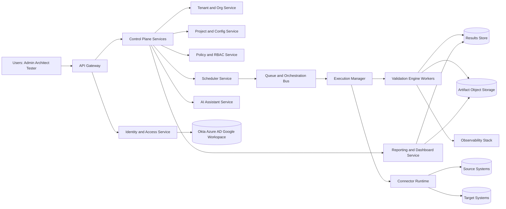
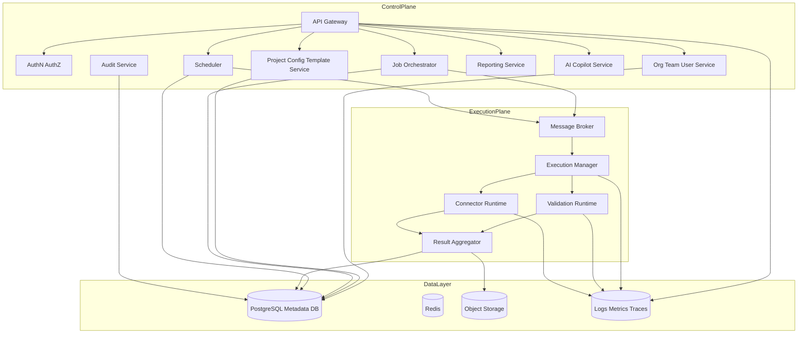

# tkk-UniversalValidator
## Software Architecture Document (Enterprise Edition)
Version: 1.0
Date: 2026-06-30
Status: Proposed Architecture Baseline

## 1. Product Vision
Build a multi-tenant, enterprise-grade Universal Data Validation Platform that validates data across files, APIs, databases, cloud data platforms, and BI data assets with strong governance, security, explainability, and operational reliability.

Target outcomes:
- Reduce data validation cycle time by at least 70%.
- Detect data defects before production impact.
- Support large enterprises with thousands of teams and hundreds of thousands of users.
- Offer no-code, low-code, and API-first validation experiences.

## 2. Reference Project Analysis (1IB_universal-validator)
This section uses 1IB_universal-validator only as a reference baseline.

Strengths identified:
- Broad validation coverage for structural, content, and regression checks.
- Adapter pattern for file, table, and datasource access.
- Great Expectations integration and anomaly detection support.
- Practical CLI workflow and report generation.
- BI regression capability is a strong differentiator.

Weaknesses identified:
- Primarily single-process architecture, limited horizontal scalability.
- No enterprise IAM, SSO, or centralized policy control.
- No multi-tenant isolation model.
- Limited scheduling, queueing, and distributed execution controls.
- Limited team administration, RBAC depth, and audit controls.
- Missing product-grade API, UI-first architecture, and plugin marketplace model.

Missing enterprise capabilities:
- Tenant-aware control plane and execution plane separation.
- Policy-based authorization and feature entitlements.
- Job orchestration, retry policies, dead-letter queues.
- Secrets vault abstraction and key rotation workflows.
- Cost governance, quotas, and usage metering.
- Disaster recovery with defined RPO/RTO and runbooks.

## 3. Functional Requirements
Core functional capabilities:
- Data source onboarding for files, APIs, databases, cloud object stores, lakehouse systems, and BI metadata sources.
- Validation design using templates, reusable rulesets, and project-level configuration.
- Validation execution modes: ad hoc, scheduled, event-triggered, pipeline-triggered.
- Validation classes:
  - Schema and metadata checks.
  - Data quality checks.
  - Record-level reconciliation.
  - Statistical anomaly detection.
  - Great Expectations rule execution.
- Result publication:
  - Interactive dashboard.
  - Downloadable CSV, JSON, HTML, PDF.
  - Push to configured result warehouse/table.
- Team collaboration:
  - Shared projects, role-based access, approval flows.
  - Alerting and notification subscriptions.
- AI assistant:
  - Guided validation authoring.
  - Natural-language run diagnostics.
  - Test recommendation and coverage insights.

## 4. Non-Functional Requirements
- Availability: 99.95% (business tier), 99.99% (enterprise tier).
- Scalability: 100,000+ concurrent users, 1M+ daily validation jobs.
- Latency:
  - API P95 < 300 ms for metadata endpoints.
  - Job scheduling acknowledgement < 2 seconds.
- Security: zero-trust posture, SSO, MFA, least privilege.
- Compliance-ready: SOC 2, ISO 27001, GDPR support controls.
- Observability: full distributed tracing, tenant-level metrics, immutable audit logs.
- Maintainability: modular architecture with versioned contracts.

## 5. Enterprise Architecture
Architecture style:
- Control Plane + Data Plane + Plugin Ecosystem.

Logical domains:
- Identity and Access Domain.
- Tenant and Organization Domain.
- Project and Configuration Domain.
- Connector and Data Access Domain.
- Validation Engine Domain.
- Orchestration and Scheduler Domain.
- Result and Analytics Domain.
- AI Assistant Domain.
- Platform Operations Domain.

Design principles:
- API-first and event-driven.
- Tenant isolation by design.
- Stateless compute, stateful stores.
- Contract-based integration.
- Explicit governance and auditability.

## 6. High-Level Architecture Diagram

## 7. Low-Level Architecture
Service decomposition:
- API Gateway Service.
- Identity Broker Service.
- Tenant Management Service.
- Team and Membership Service.
- RBAC and Policy Service.
- Project and Folder Service.
- Connection Catalog Service.
- Secret Reference Service.
- Validation Template Service.
- Job Orchestrator Service.
- Scheduler Service.
- Queue Router and Worker Manager.
- Validation Engine Runtime.
- Connector Runtime.
- Results Aggregation Service.
- Dashboard Query Service.
- Notification Service.
- Audit Service.
- AI Copilot Service.

Runtime patterns:
- Synchronous APIs for control operations.
- Asynchronous event processing for job lifecycle.
- Idempotent commands with correlation IDs.
- Compensating actions for partial failures.

## 8. Microservice vs Modular Monolith Recommendation
Recommendation:
- Phase 1 and Phase 2: Modular Monolith for core control plane plus independently scalable execution workers.
- Phase 3 onward: Progressive extraction to microservices for high-churn or high-scale domains.

Reasoning:
- Faster delivery and reduced operational overhead initially.
- Clean domain boundaries from day one prevent future rewrite.
- Execution workloads already decoupled through queue-driven workers.

Extraction priority sequence:
- Scheduler and Job Orchestrator.
- AI Assistant.
- Reporting and Analytics.
- Connector Marketplace.

## 9. Folder Structure (Target Architecture Blueprint)
Top-level architecture blueprint:
- backend: Control plane APIs and domain modules.
- execution: Worker services and runtime engines.
- frontend: Web application.
- desktop: Optional enterprise desktop client.
- mobile: Lightweight operations app.
- shared: Shared contracts, schemas, SDK interfaces.
- plugins: Plugin SDK and plugin manifests.
- connectors: Connector implementations and adapters.
- validators: Validation packs and rule libraries.
- scheduler: Scheduling logic and triggers.
- chatbot: Conversational domain logic.
- ai: Prompt orchestration, RAG pipelines, model adapters.
- config: Environment and deployment configs.
- database: Schema docs, migration plans, data dictionaries.
- docker: Container definitions.
- kubernetes: Helm and K8s manifests.
- terraform: IaC modules.
- scripts: Operational and release scripts.
- tests: Unit, integration, contract, load, security tests.
- docs: Product and engineering docs.
- architecture: ADRs, TDRs, diagrams.
- examples: Sample workflows.
- sample_configs: Sample YAML/JSON validation specs.
- .github: CI/CD workflows and templates.

## 10. Technology Stack
Backend:
- Python 3.12, FastAPI, Pydantic v2, SQLAlchemy 2.x.
- Background processing: Celery or Temporal workers.

Data processing:
- Pandas for small-medium datasets.
- PySpark for large-scale distributed workloads.
- Polars and DuckDB for high-performance local analytics options.

Frontend:
- Next.js with TypeScript, MUI for enterprise UI consistency.
- Recharts/ECharts for analytics visualizations.

Data stores:
- PostgreSQL for transactional metadata.
- Redis for caching and short-lived orchestration state.
- Object storage (S3/Azure Blob/GCS) for artifacts.
- Optional OpenSearch for search and log analytics.

Messaging and scheduling:
- RabbitMQ or Kafka for queue/event transport.
- Scheduler service with cron and event triggers.

Security:
- OAuth2/OIDC, SAML federation via enterprise IdP.
- Vault abstraction for secret references.

## 11. Plugin Architecture
Plugin model:
- Connector plugins.
- Validator plugins.
- Reporter plugins.
- Notification plugins.
- AI tool plugins.

Plugin contract:
- Manifest with semantic version, capabilities, scopes, compatibility range.
- Signed package and checksum verification.
- Sandboxed execution with policy-scoped permissions.
- Plugin lifecycle hooks: install, validate, activate, deactivate, upgrade.

Governance:
- Plugin approval workflow.
- Tenant-level plugin allowlist.
- Runtime policy enforcement and telemetry.

## 12. Validation Engine Design
Execution stages:
- Plan: resolve sources, target, schema, and policies.
- Prepare: infer partitioning, choose compute backend.
- Execute: run selected validation packs.
- Reconcile: aggregate row/column/check-level outputs.
- Publish: store results and emit notifications.

Engine modes:
- Lightweight mode for quick checks.
- Deep regression mode for release validation.
- Continuous mode for streaming or periodic checks.

Adaptive compute policy:
- Automatically selects Pandas/Polars for smaller datasets.
- Switches to Spark for large-volume or distributed data.
- Allows tenant override with quota-aware governance.

## 13. Connector Framework
Connector categories:
- Database connectors.
- File and object storage connectors.
- API connectors.
- BI metadata connectors.
- Lakehouse connectors.

Connector capabilities:
- Schema introspection.
- Predicate pushdown.
- Incremental extraction.
- Credential abstraction via secret references.
- Resilient retries with circuit breakers.

## 14. Authentication Architecture
- Enterprise SSO with OIDC/SAML via Okta, Azure AD, Google Workspace.
- MFA enforcement by policy.
- Short-lived JWT access tokens, rotating refresh tokens.
- Service-to-service mTLS and workload identity.

## 15. Authorization Architecture
- Central policy decision point (PDP) and policy enforcement points (PEP).
- RBAC plus attribute-based constraints for tenant, team, project, environment.
- Fine-grained permissions for connectors, jobs, results, and admin operations.

## 16. RBAC Design
System roles:
- Super Admin.
- Org Admin.
- Team Admin.
- Architect.
- Tester.
- Auditor.
- Viewer.

Permission model:
- Resource-action-scope tuples.
- Example scopes: org, team, project, environment, connection.
- Deny-by-default with explicit grants.

## 17. Team Management Design
- Organization contains teams and team membership.
- Project ownership can be team-owned or user-owned.
- Invitation flows with domain restrictions.
- Delegated administration and temporary elevation with approvals.

## 18. Database Design (Logical)
Primary data domains:
- Identity and organization metadata.
- Configuration and templates.
- Job orchestration and execution state.
- Validation outcomes and artifacts.
- AI conversation and prompt lineage.
- Audit and compliance logs.
- Licensing and subscription metadata.

Storage strategy:
- OLTP metadata in PostgreSQL.
- Large artifacts in object storage.
- Time-series operational metrics in monitoring stack.

## 19. API Design
API style:
- REST for control-plane operations.
- WebSocket/SSE for live execution updates.
- Optional GraphQL read model for dashboard composition.

API standards:
- Versioned endpoints (/v1, /v2).
- Idempotency keys for job submission.
- Consistent error envelope and correlation IDs.
- OpenAPI-first contracts.

## 20. Scheduler Design
Trigger types:
- Cron schedules.
- Event triggers (file arrival, webhook, pipeline event).
- Dependency triggers (run-after successful upstream validation).

Operational controls:
- Misfire policies.
- Retry backoff and max attempts.
- Blackout windows and maintenance mode.

## 21. Queue Design
Queue topology:
- Job submission queue.
- Priority queue.
- Connector execution queue.
- Result finalization queue.
- Dead-letter queue.

Queue guarantees:
- At-least-once delivery with idempotent worker processing.
- Ordered processing by partition key where required.

## 22. Result Storage Design
Result layers:
- Summary layer: job-level KPIs.
- Detail layer: check, column, and row-level deltas.
- Artifact layer: downloadable reports, plots, logs.

Retention:
- Hot storage for recent runs.
- Warm archive for historical analytics.
- Configurable tenant retention policy.

## 23. Dashboard Architecture
Dashboard modules:
- Executive overview.
- Job health and trends.
- Data quality scorecards.
- Failure diagnosis and drill-down.
- Team productivity and SLA panels.

Technical pattern:
- Read-optimized query models.
- Cached aggregate views.
- Multi-tenant row-level data filtering.

## 24. AI Chatbot Architecture
AI responsibilities:
- Validation configuration assistant.
- Query and rule generation assistant.
- Failure triage and explanation assistant.
- Historical trend Q&A assistant.

Architecture components:
- Prompt orchestration service.
- Policy-aware tool calling layer.
- Retrieval layer over approved docs/configs.
- Conversation memory with tenant isolation.
- Safety and governance filters.

## 25. Logging
- Structured JSON logs with trace_id, span_id, tenant_id, user_id.
- Log levels by domain and environment.
- PII and secret redaction pipeline.
- Centralized retention and search.

## 26. Monitoring
- Metrics: API latency, job throughput, queue lag, worker utilization.
- Traces: end-to-end request and job spans.
- Alerts: SLO burn-rate, error budgets, queue stalls, auth anomalies.
- Synthetic probes for key user journeys.

## 27. Security
- Zero-trust network segmentation.
- Encryption in transit (TLS 1.2+) and at rest (KMS-managed keys).
- Secret manager integration with rotation.
- Vulnerability scanning and software bill of materials.
- Continuous audit logging with tamper-evident storage.

## 28. Deployment Strategy
- Cloud-native deployment on Kubernetes.
- Blue/green and canary release support.
- Separate environments: dev, test, stage, prod.
- GitOps-controlled release flows.

## 29. Disaster Recovery
- Multi-region backup replication.
- Infrastructure state backup and restore runbooks.
- Regular DR simulation exercises.
- RPO target: <= 15 minutes.
- RTO target: <= 60 minutes.

## 30. High Availability
- Multi-AZ deployment for all critical services.
- Stateless service autoscaling.
- Database HA with read replicas and automated failover.
- Queue cluster redundancy.

## 31. Multi-Tenancy
Tenant isolation model:
- Shared control plane with strict logical isolation.
- Tenant-scoped encryption keys and policies.
- Optional dedicated tenant deployment for regulated customers.

Data isolation controls:
- Tenant ID mandatory in all primary entities.
- Row-level and policy-level guards.
- Per-tenant quotas and throttling.

## 32. Licensing Model
Editions:
- Community: core validations, limited connectors, basic reports.
- Professional: advanced connectors, scheduling, team workflows.
- Enterprise: SSO, advanced RBAC, audit, DR, private deployment.

Usage dimensions:
- Active users.
- Number of projects.
- Validation run volume.
- Data volume processed.
- Premium AI consumption credits.

## 33. Future Roadmap
Near-term (0-6 months):
- Enterprise SSO, RBAC, scheduler, queue-backed execution.
- API-first control plane and baseline dashboard.
- Plugin SDK v1 and connector certification.

Mid-term (6-18 months):
- Marketplace for connectors and validators.
- Advanced observability and cost governance.
- AI copilots for auto-rule recommendation.

Long-term (18-36 months):
- Cross-tenant benchmarking (privacy-preserving).
- Autonomous remediation playbooks.
- Hybrid and edge execution models.

## 34. High-Level Domain Diagram (Detailed)

## 35. Architecture Decision Summary
Primary recommendation:
- Adopt a domain-modular control plane with queue-decoupled execution workers.

Why this fits your objective:
- Delivers enterprise controls quickly.
- Scales execution independently from user traffic.
- Supports large connector/validator ecosystem growth.
- Keeps a practical path from initial release to hyperscale product maturity.

## 36. 10-Year Maintainability Guardrails
- Domain ownership model with clear service boundaries.
- Versioned API and event contracts.
- Architecture Decision Records for every major change.
- Backward-compatibility and deprecation policies.
- Quarterly architecture review board and technical debt budget.

## 37. Acceptance Baseline for Architecture Sign-Off
The architecture is approved when:
- All required domains have service boundaries and data ownership.
- Multi-tenant, security, audit, and DR controls are testable.
- Performance SLOs and scale targets have measurable metrics.
- Plugin and connector contracts are versioned and enforceable.
- Operational runbooks exist for incident, rollback, and recovery.
